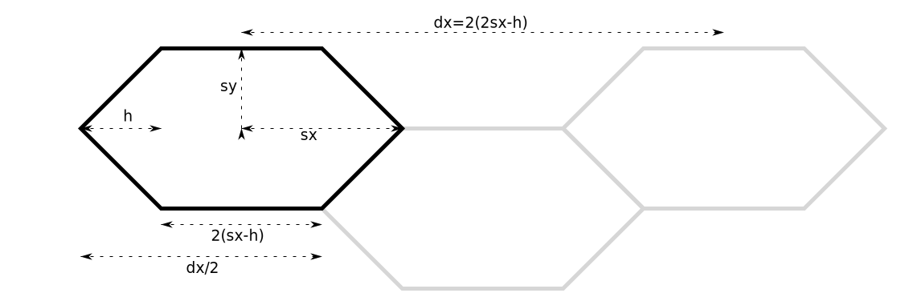

# Hex-games

Experiments with turn-based games on a hex grid.

I have wanted to write a hex based, turn-based game for a long time. I
have actually started (and abandoned) such projects at least 3
times. A problem has been what language and graphic environment to
use. This take I use HTML5/canvas and JavaScript.

Much inspiration (and code) is taken from [Red Blob Games](
https://www.redblobgames.com/). An excellent site! I covers most
aspects, for instance [map generation](
https://www.redblobgames.com/maps/mapgen2/).


## admin.sh

Most things are done with the [admin.sh](admin.sh) script.
```
./admin.sh               # Help printout
./admin.sh env           # Print working environment
./admin.sh build --open  # Build the default project and open a browser window
```

[Esbuild](https://esbuild.github.io/) is used to build bundles and
must be in the path.

Set environment variables if necessary. Example:
```
export __project=/absolute/path/to/my/project
export __browser=$HOME/bin/firefox/firefox
```


## Hexagons

I want non-regular flat-top hexagons, so a single *size* parameter is
not sufficient. Instead the hexagons are defined by *(sx, sy, h)*:



For regular hexagons, set $s_y = s_x\sqrt 3/2$ and $h = s_x/2$,
for instance (40,34.6,20).

Now a hex path can be created as:

```javascript
const d = 2 * (sx - h);
let hex = new Path2D(`m ${-sx} 0 l ${h} ${-sy} ${d} 0 ${h} ${sy} ${-h} ${sy} ${-d} 0 z`);
```

## Hex grid

A hex grid can be created by adding hex Path2D's with appropriate
spacing. [grid0](grid0/grid0.js) is an example.

All lines inside the grid are drawn twice, and it shows (but not
much). This is non-trivial to fix and messes up the code, so I don't
care for now. And BTW, creating the grid is a one-time event, so speed
is not an issue.

