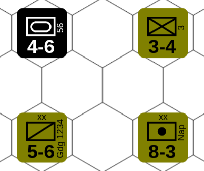

# Hex-games

Experiments with turn-based games on a hex grid.

I have wanted to write a hex based, turn-based game for a long time. I
have actually started (and abandoned) such projects at least 3
times. A problem has been what language and graphic environment to
use. This take I use HTML5/canvas, SVG and JavaScript.

Much inspiration (and code) is taken from [Red Blob Games](
https://www.redblobgames.com/). An excellent site! [Konva](
https://konvajs.org/docs/index.html) is used for most canvas
manipulations.

I am also trying to get the old (1974) board game [Rise and Decline of
the Third Reich](rdtr/README.md) (RDTR) to run in a browser.

#### Try a release

Unzip the release-asset `hex-games.zip` and open `index.html`
in your browser. No dependencies needed!

**WARNING:** On Ubuntu Linux, Firefox may run in a "snap sandbox", so
  you can't browse local files. If so, I suggest to switch to Chrome.


## Development

Dependencies:

* [esbuild](https://esbuild.github.io/) - Must be in your $PATH
* [Konva](https://konvajs.org/docs/index.html) - Scripts must be able to import
* [Inkscape](https://inkscape.org/) - for SVG drawing

Most things can be done with the [admin.sh](admin.sh) script.
```
eval $(./admin.sh alias) # Define "admin" alias with command completion
admin                    # Help printout
admin env                # Print working environment
admin <tab><tab>         # suggest available commands
```

Set environment variables if necessary. Example:
```
export GITHUBD=$HOME/go/src/github.com
export BROWSER=/opt/google/chrome/chrome
```

### Versioning

[Semantic versioning](https://semver.org/) is used in the defined way.

A non-pre-relase, i.e. with a major version >0, is not guaranteed to
be "stable" (whatever that means). What *is* guaranteed is
compatibility. If I make an incompatible update, I will step the major
version.

For now, an incompatible update means an incompatible change of
[RDTR](rdtr/README.md) save/scenario file format.


## Hex grid

The hex grid should be a pattern. Either an
[SVG pattern](https://developer.mozilla.org/en-US/docs/Web/SVG/Tutorials/SVG_from_scratch/Patterns),
or a Konva `fillPatternImage`. Below are examples of SVG patterns:

<p float="left">
  
  
</p>

These images were created with:
```
eval $(./hex.py emit-completion)
hex emit-grid --size 40 --rect 480x240  > figures/hexp.svg
hex emit-grid --size 40 --rect 480x240 --flattop > figures/hexf.svg
```

An svg-pattern-grid can be created in this way and be imported as a
"layer" in `Inkscape`. A "layer" is actually an SVG "group" that you
can manipulate from a javascript, e.g. set transparency.

A Konva `fillPatternImage` can be generated by the script, please see
the `patternSvg` function in [hex-grid.js](./grid/hex-grid.js).

Konva fillPatternImage's are a delight to work with. For example, you
can use `fillPatternOffset` to align the grid with a map image. And
*always* set:

```
   // (compensate for pixel rounding errors)
   fillPatternScale: hex.patternScale(),
```

Please, check the grid demo in the release.

## Battle for Wesnoth maps

The [Battle for Wesnoth](https://www.wesnoth.org/) (BfW) is a very
good turn-base hex game. It's open source and you can get it from
[steam](https://store.steampowered.com/app/599390/Battle_for_Wesnoth/).
BfW comes with a great map editor! The exercise here is to use a BfW
map in our own game.

Export the BfW map as png. Here I use the most basic tutorial map:
```
cd /path/to/wesnoth/usr/local
wesnoth --screenshot \
  share/wesnoth/data/campaigns/tutorial/maps/02_Tutorial_part_2.map wn2.png
```
The map is exported without a grid, so we will add one as an exercise

### Battle for Wesnoth map License

The BfW [wiki](https://wiki.wesnoth.org/Wesnoth:Copyrights) explains
that all BfW content, including maps, are under [GNU GPL v2](
https://www.gnu.org/licenses/old-licenses/gpl-2.0.en.html) license. I
have added license metadata in [wn2.png](./figures/wn2.png) with
[exiftool](https://exiftool.org/):

```
> exiftool figures/wn2.png
...
Copyright                       : Authors of https://www.wesnoth.org/
Creator                         : https://github.com/wesnoth/wesnoth
Rights                          : GNU GPL v2+
Image Size                      : 2232x1548
```

### Add grid

The hexes are "flattop", and the map height is 21.5 hexes and 1548
pixels. This gives a `size` of 1548/21.5=72. The `scale` is
trickier. I am sure there is a way to compute it exactly, but I made
some tedious trial-and-error to find out. Here is a grid that seems to
fit:
```
hex emit_grid --flattop --rect 2200x1600 --size 72 --scale 0.865 > bfw-grid.svg
```

Now you can use the [hex-grid module](grid/hex-grid.js) to add a
grid. The offsets must also be tuned, and this time I think
trial-and-error is best.

The result is in [bfw-map/main.js](bfw-map/main.js). This is also an
example on how images can be loaded synchronously, one after the
other, using [await](
https://developer.mozilla.org/en-US/docs/Web/JavaScript/Reference/Operators/await).

## Units

Unit is often called "counters" or "unit counters", but it is
confusing when programming.

Units may be any image or figure really, but there is support for
generating "standard" unit counters as Konva.Group's. Example:



```javascript
u = units.createUnit('olive', 'black', 'art', '8-3', 'xx', 'Nap')
```

Only some unit types can be generated, but more may be added when
needed.

## Map

A game map can be created in many ways, like generating from some
simple format as [Battle for Wesnoth](https://www.wesnoth.org/), or
from pre-drawn tiles like [Panzer General](
https://en.wikipedia.org/wiki/Panzer_General). In `hex-games` I do:

1. Generate a hex-grid (SVG)
2. Draw the map graphics with [Inkscape](https://inkscape.org/)
3. Define the map with a `map-maker` program

Draw the map:
```
hex emit-grid --rect=1400x1000 > example-map.svg
inkscape example-map.svg &
```

### Map maker

We must define properies of hexes, such as terrain, and possible for
edges between hexes, e.g. some obstacles. A `map-maker` shows the map
and let you defining this by clicking on hexes. The `map-maker` is
specific for a type of map, and must be adapted for different
maps. However the procedure is very similar and [map-maker.js](
map-maker/map-maker.js) serves as a template. The result is a `json`
file, something like:

```json
[
  {{"hex":{"x":21,"y":8},"prop":"f"},
  {"hex":{"x":3,"y":11},"edges":"u....u"}  
]
```

**NOTE**: The definition can (and probably often is) "sparse". Meaning
that only "interresting" hex'es are defined. For instance, if the
majority of hexes are "plain", you may leave them undefined

The dimensions of the map are *not* defined in this json file.

The [example map](./map-maker/example-map.svg) has 3 terrain types:
forrest (f), river (r) and mountain (m). It has one edge type:
up-slope (u), which can give combat/movement penalties.

The `json` file is used to store the map [in any way you prefer](
https://www.redblobgames.com/grids/hexagons/#map-storage).  Personally
I prefer to use a hash table (javascript Map()).  A hex object can
*not* be used as key since the object reference is used, instead
create a key something like:

```javascript
  let key = hex.x + hex.y * 1000
```

## Red Blob Games

[Red Blob Games](https://www.redblobgames.com/)
([github](https://github.com/redblobgames)) is truly amazing. It seems
to cover everything! For instance [hex-grids](
https://www.redblobgames.com/grids/hexagons/). Older examples are
written in [ActionScript](https://en.wikipedia.org/wiki/ActionScript)
(flash), but newer are in JavaScript and [HTML5 canvas](
https://en.wikipedia.org/wiki/Canvas_element).

### Mapgen2 - ActionScript version

Here is a [demo of generated hex-maps](
https://theory.stanford.edu/~amitp/game-programming/polygon-map-generation/demo.html) ([github](https://github.com/amitp/mapgen2)). Clone it and update
submodules with `git submodule update --init`.

To build you need the [Flex SDK](
https://flex.apache.org/download-binaries.html). That in turn needs
`playerglobal.swc` which is hard to find since Adobe has cut support
(and downloading). After some google'ing I found it [here](
https://github.com/nexussays/playerglobal/blob/master/11.5/playerglobal.swc).
[Ruffle](https://github.com/ruffle-rs/ruffle) is used for flash emulation.
This project is maintained and built fine on my Ubuntu 24.04 LTS. Then run
`mapgen2.swf` with ruffle.

If you have cloned to `$GITHUBD` and downloaded required files, do:
```
admin red-blob-check
admin mapgen2-as-build
admin mapgen2-as-run
```

### Mapgen2

The new version of [mapgen2](https://www.redblobgames.com/maps/mapgen2/)
([github](https://github.com/redblobgames/mapgen2/))
uses JavaScript and HTML5.

To build and run, make sure [esbuild](https://esbuild.github.io/) is
in the path, and call `./build.sh` in the mapgen2 directory. Then open
`embed.html` in your browser. Or do:

```
export BROWSER=/opt/google/chrome/chrome
admin mapgen2-build --open
```

## Non-regular Hexagons

Initially I wanted to use non-regular Hexagons (e.g. for an isometric
view), but it becomes messy so I have abandoned this for now. A single
*size* parameter is not sufficient. Instead the hexagons may be
defined by *(sx, sy, h)*:


