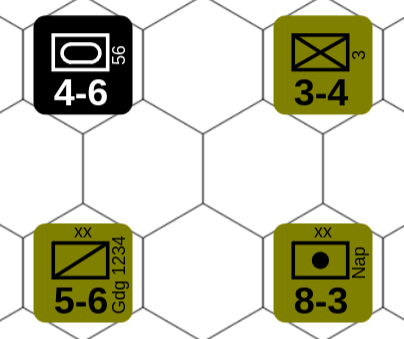
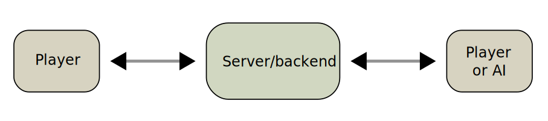
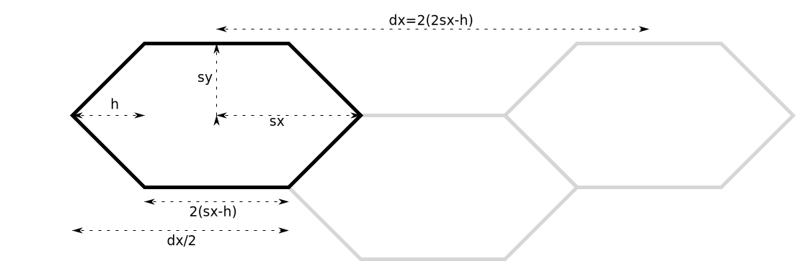

# Hex-games

Experiments with turn-based games on a hex grid.

I have wanted to write a hex based, turn-based game for a long time. I
have actually started (and abandoned) such projects at least 3
times. A problem has been what language and graphic environment to
use. This take I use HTML5/canvas and JavaScript.

Much inspiration (and code) is taken from [Red Blob Games](
https://www.redblobgames.com/). [Konva](
https://konvajs.org/docs/index.html) is used for most canvas
manipulations. Both are *absolutely excellent!!*

I was trying to get the old (1974) board game [Rise and Decline of the
Third Reich](rdtr/README.md) (RDTR) to run in a browser. It turned out
to be far too complex to start with. So, instead I tried [Napoleon at
Waterloo](waterloo/README.md), but I got stuck on displacement on
retreat, and AI. Now I am working with [Wooden Ships & Iron Men](
ws-im/README.md), which can be played against AI, but [lacks a lot of
features](https://github.com/uablrek/hex-games/issues/3).

#### Try a release

Visit: https://hex-games.staticdomains.app/

OR:

Unzip release-asset `waterloo.zip` or `ws-im.zip` and open
`index.html` in your browser. No dependencies needed!

**WARNING:** On Ubuntu Linux, Firefox may run in a "snap sandbox", so
  you can't browse local files. If so, I suggest to switch to Chrome.

**WARNING:** On Windows you can click on the zip-file without
  unpacking it. This is **not sufficient**. The zip-file must be extracted.

#### Docker container

To play the [The battle for The Hill](./the-hill-mp/README.md)
multi-player version from a docker container:
```
docker pull uablrek/the-hill:latest
docker run -d -p 8081:8081 uablrek/the-hill:latest
# Both players opens http://<host-ip>:8081
```
**WARNING**: This container has no security. Anyone with the
  ip-address can access it!

This container is generic, it just connects player A with player
B. So, it can be used as base for other games. Dockerfile:
```
FROM uablrek/the-hill:latest
COPY --chown=0:0 / /html/
CMD ["node", "/bundle.cjs"]
```

## Development

Dependencies:

* [NPM](https://www.npmjs.com/) - For building and using the library
* [esbuild](https://esbuild.github.io/) - As packager. Must be in your $PATH
* [Konva](https://konvajs.org/docs/index.html) - Scripts must be able to import
* [ExpressJs](https://expressjs.com/) - For the game server

Most things can be done with the [admin.sh](admin.sh) script.
```
eval $(./admin.sh alias) # Define "admin" alias with command completion
admin                    # Help printout
admin env                # Print working environment
admin <tab><tab>         # suggest available commands
```

Set environment variables if necessary. Example:
```
export GITHUBD=$HOME/go/src/github.com    # (only needed for mapgen2)
export BROWSER=/opt/google/chrome/chrome  # needed for --open
```

Admin builds in a temp area. Files are copied, `esbuild` is invoked,
and files used for building are removed. Usually only `bundle.js` and
`index.html` should remain.

```
admin env | grep __appd        # the application is built in $__appd
admin build --open the-hill    # build "the-hill" and open it with $BROWSER
```

### Versioning

[Semantic versioning](https://semver.org/) is used in the defined way.

A non-pre-relase, i.e. with a major version >0, is not guaranteed to
be "stable" (whatever that means). What *is* guaranteed is library
compatibility. If I make an incompatible update, I will step the major
version.

The example-games (e.g. [NaW](waterloo/README.md)) are updated with a
minor version increment. The major version is only for library
compatibility.

## Hex grid

The hex grid should be a pattern. Either an
[SVG pattern](https://developer.mozilla.org/en-US/docs/Web/SVG/Tutorials/SVG_from_scratch/Patterns),
or a Konva `fillPatternImage`. Below are examples of SVG patterns:

<p float="left">
  
  
</p>

These images were created with:
```
eval $(./hex.py emit-completion)
hex emit-grid --size 40 --rect 480x240  > figures/hexp.svg
hex emit-grid --size 40 --rect 480x240 --flattop > figures/hexf.svg
```

An svg-pattern-grid can be created in this way and be imported as a
"layer" in `Inkscape`. A "layer" is actually an SVG "group" that you
can manipulate from a javascript, e.g. set transparency.

A Konva `fillPatternImage` can be generated by the script, please see
the `patternSvg` function in [grid.js](./lib/grid.js).

Konva fillPatternImage's are a delight to work with. For example, you
can use `fillPatternOffset` to align the grid with a map image. And
*always* set:

```
   // (compensate for pixel rounding errors)
   fillPatternScale: grid.patternScale(),
```

Please, also check the grid demo.

## Units

Units are often called "counters" or "unit counters", but it is
confusing when programming.

Units may be any image or figure really, but there is support for
generating "standard" unit counters as Konva.Group's. Example:



```javascript
const units = [
    {nat:'ge' , type:'pz', stat:'4-6', lbl:'56'},
    {color:'olive', type:'inf', stat:'3-4', lbl:'3'},
    {color:'olive', type:'cav', stat:'5-6', sz:'xx', lbl:'Gdg 1234'},
    {color:'olive', type:'art', stat:'8-3', sz:'xx', lbl:'Nap'},
]
```

Only some unit types can be generated by the library, but unique units
can be defined in individual games.


## Map

A game map can be created in many ways, like generating from some
simple format as [Battle for Wesnoth](https://www.wesnoth.org/), or
from pre-drawn tiles like [Panzer General](
https://en.wikipedia.org/wiki/Panzer_General). Possible procedure:

1. Generate a hex-grid (SVG)
2. Draw the map graphics with [Inkscape](https://inkscape.org/)
3. Define the map with a `map-maker` program

Draw the map:
```
hex emit-grid --rect=1400x1000 > example-map.svg
inkscape example-map.svg &
```

Or you can create absolutely beautiful maps using the [wargames_tex](
https://gitlab.com/wargames_tex) package by Christian Holm
Christensen. But the learning curve is pretty steep.


### Map maker

We must define properies of hexes, such as terrain, and possible for
edges between hexes, e.g. some obstacles. A `map-maker` shows the map
and let you defining this by clicking on hexes. The `map-maker` is
specific for a type of map, and must be adapted for different
maps. However the procedure is very similar and [map-maker.js](
map-maker/map-maker.js) serves as a template. The result is a `json`
file, something like:

```json
[
  {"hex":{"x":21,"y":8},"prop":"f"},
  {"hex":{"x":3,"y":11},"edges":"u....u"}  
]
```

**NOTE**: The definition can be (and probably often is)
"sparse". Meaning that only "interresting" hex'es are defined. For
instance, if the majority of hexes are "plain", you may leave them
undefined

The dimensions of the map are *not* defined in this json file.

The [example map](./map-maker/example-map.svg) has 4 terrain types:
forrest (f), river (r), water (w) and mountain (m). It has one edge
type: up-slope (u), which can give combat/movement penalties.

The `json` file is used to store the map [in any way you prefer](
https://www.redblobgames.com/grids/hexagons/#map-storage).  Personally
I prefer to use a hash table (javascript Map()). A hex reference can
*not* be used as key since the object reference is used, instead
create a key something like:

```javascript
  let key = hex.x + hex.y * 1000
```

But, please note that the actual map-hex-objects *can* be used as keys
in a Map() or objects in a Set() since their reference never changes.

## Multi-player



Multi-player gaming requires a server. This is interactive, so
[websockets](https://en.wikipedia.org/wiki/WebSocket) are used. How
functions are distributed between the server and clients is
described in a good way in [this post](
https://longwelwind.net/blog/networking-turn-based-game/). The
extremes are something like:

* The server only relays messages between players. It knows nothing
  about the game (and can thus be generic)

* The server controls everything. The clients just send user actions
  to the server, and updates the UI on server commands

Both have pros and cons. In `hex-games` a generic (dumb) server is
provided. It relays messages between two clients named 'A'
and 'B' using [express-ws](https://www.npmjs.com/package/express-ws).
It can also save games, and a die-roll function is planned.

[the-hill-mp](./the-hill-mp/README.md) is a multi player version of
[The Battle for The Hill](./the-hill/README.md) example game using
the generic server.


## Red Blob Games

[Red Blob Games](https://www.redblobgames.com/)
([github](https://github.com/redblobgames)) is truly amazing. It seems
to cover everything! For instance [hex-grids](
https://www.redblobgames.com/grids/hexagons/). Older examples are
written in [ActionScript](https://en.wikipedia.org/wiki/ActionScript)
(flash), but newer are in JavaScript and [HTML5 canvas](
https://en.wikipedia.org/wiki/Canvas_element).

### Mapgen2 - ActionScript version

Here is a [demo of generated hex-maps](
https://theory.stanford.edu/~amitp/game-programming/polygon-map-generation/demo.html) ([github](https://github.com/amitp/mapgen2)). Clone it and update
submodules with `git submodule update --init`.

To build you need the [Flex SDK](
https://flex.apache.org/download-binaries.html). That in turn needs
`playerglobal.swc` which is hard to find since Adobe has cut support
(and downloading). After some google'ing I found it [here](
https://github.com/nexussays/playerglobal/blob/master/11.5/playerglobal.swc).
[Ruffle](https://github.com/ruffle-rs/ruffle) is used for flash emulation.
This project is maintained and built fine on my Ubuntu 24.04 LTS. Then run
`mapgen2.swf` with ruffle.

If you have cloned to `$GITHUBD` and downloaded required files, do:
```
admin red-blob-check
admin mapgen2-as-build
admin mapgen2-as-run
```

### Mapgen2

The new version of [mapgen2](https://www.redblobgames.com/maps/mapgen2/)
([github](https://github.com/redblobgames/mapgen2/))
uses JavaScript and HTML5.

To build and run, make sure [esbuild](https://esbuild.github.io/) is
in the path, and call `./build.sh` in the mapgen2 directory. Then open
`embed.html` in your browser. Or do:

```
export BROWSER=/opt/google/chrome/chrome
admin mapgen2-build --open
```

## Non-regular Hexagons

Initially I wanted to use non-regular Hexagons (e.g. for an isometric
view), but it becomes messy so I have abandoned this for now. A single
*size* parameter is not sufficient. Instead the hexagons may be
defined by *(sx, sy, h)*:


