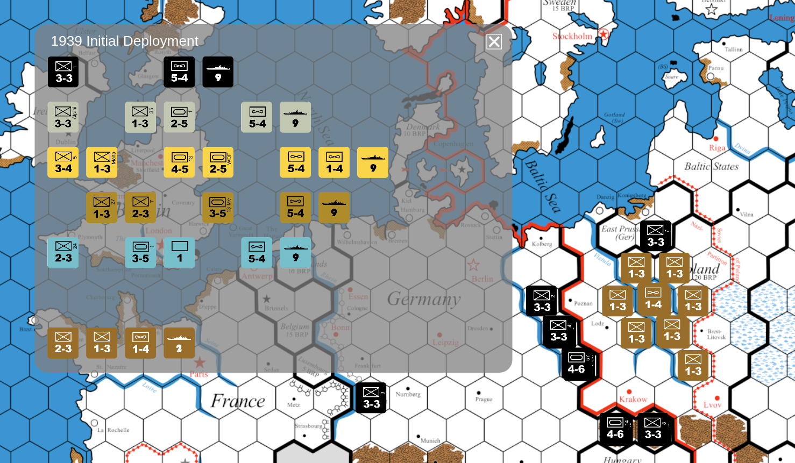

## Rise and Decline of the Third Reich

An old dream of mine is to write a computer version of the
[Rise and Decline of the Third Reich](
https://en.wikipedia.org/wiki/Rise_and_Decline_of_the_Third_Reich)
board game (RDTR from now on), which I played a lot in the late 1970's.
There are actually several computer versions already written, e.g. on
[Vasall](https://vassalengine.org/library/projects?q=Third+Reich),
but I want to try it myself with JavaScript and HTML5/canvas.

The [rules](http://www.wargameacademy.org/3R4/3R4-rulebook-070908.pdf)
are *horribly* complex, so just make a program enforce them would be a
daunting task. I will start with basic mecanics like draw the map, and
moving counters (units) on it.

There are many resources at [BGG](
https://boardgamegeek.com/boardgame/1563/rise-and-decline-of-the-third-reich/files?pageid=1).
I use the *excellent* works of [John_AHfan](
https://boardgamegeek.com/profile/John_AHfan). Here are his conditions:

> The creator of this file makes no copyright claim on this work nor
> should anyone who possesses a copy of it, or derives/creates
> anything from it. Include this statement with the file and anything
> derived from it. This work should not be used for commercial
> purposes, except to charge reasonable fees for services such as
> printing.

I am using JavaScript and the [Konva](https://konvajs.org/docs/index.html)
framework. Bundles are created with [esbuild](https://esbuild.github.io/).

This is a Work In Progress (WIP). I will document the development
process for myself, and others. I will include dead-ends, abandoned
ideas, new ideas, mess-up's, etc. I am new at JavaScript, so there may
be many of them. I will create relases on
[github](https://github.com/uablrek/hex-games/releases). To test a
release:

1. Download `hex-games.zip` release Asset
2. Unpack it locally (you *must* unpack on Windows. Not just dive into the zip archive)
3. Open `rdtr/index.html` in your browser


## The game

to play RDTR you need [the rules](
https://boardgamegeek.com/filepage/246525/third-reich-4th-edition-rulebook-clone)
which are *extremly* complex. You also need the [player cards](
https://boardgamegeek.com/filepage/246970/third-reich-player-cards-pdf)
which describes the starting conditions. Armed with these you can try
a solitaire game to learn the rules, or a hot-seat game if you know
enough of the rules, and have a friend to play with. BTW, I can say I
didn't know all rules back in the 1970's, and much less today.

This is basically a replica of the board game on your browser. You must
do (almost) everything yourself (same as the board game). You may use a
[spreadsheet](https://boardgamegeek.com/filepage/128258/3r4-bookkeeping-aid-for-brps-and-other-in-game-dat)
for book-keeping. When you start a game you will see something like this:



The screen-shot shows the initial deployment phase for the 1939
scenario. The gray box is called a `UnitBox`. You can drag counters
from the UnitBox and place them anywhere on the board. The UnitBox
itself can also be dragged to a convenient place. The player cards
says that the order of deployment for 1939 is: Poland, Italy, France,
Britain, Russia, Germany. But in a solitaire game, that doesn't matter of
course.

Make sure to deploy *all* counters in the Initial Deployment, then
**Save!**. In general, save often! If you reload the page, or close
the browser, everything from the last save is lost. You don't have to
copy the save file to the app directory each time you save, just when
you want to restore.

Instructions:

* **Help** - hit `h` for a key help page
* **Move around on the map** - The map is draggable (but not scrollable)
* **Deploy units** - Drag them from a UnitBox and drop them on the map
* **Save game** - Hit `Shift-S`. A download dialogue will pop-up, and
    you can select the local file
* **Restore game** - Copy a save-file to "rdtrSaveData.js" in the
    app directory (/path/to/hex-games/rdtr). Then reload the game page (F5).
	([more info](#save-and-restore))
* **Resize and zoom the browser window** - *Save-and-Restore, then*
    experiment to your heart's content. Reload the page (F5) to test a
    new setting
* **Movement** - Drag any counter to any place on the map
* **Remove a counter** - `Shift-click` on the counter
* **Combat** - Move your counters into place, compute the odds, and
    roll a die. Remove losers, and move succesful attackers. The game
    will not help you with this.
* **Buy units** - Hit `b` to bring up units allowable for
    buying. You must keep track of BRP and players yourself. If you make a
    misstake and remove a counter you just bought, it will *not* be
    returned to the open UnitBox. But if you close the UnitBox and re-open, it
    will be there
* **Break up 5-4 air units** - Hit `a` to bring up the Air Exchane
    box. Remove the 5-4 unit, and drag replacements from the box.
	Air bases are also in this box
* **Break up naval units** - Hit `f` to bring up the Fleet Exchange
    box, and do the same as for air units
* **Neutrals and minor allies** - Hit `n` to bring up the Neutrals
    box. Drag counters to the map
* **Advance the game turn** - Hit `t` to see the current turn and `T`
    to advance to the next turn. The game doesn't care about turns,
    *except* that new units becomes allowable at certain turns in the
    Campaign game (please see the player cards). In non-campaign
    games, the turn is purely informational
* **Year Start Sequence (YSS)** - Is handled by you outside the game
* **Strategic Warfare (SR)** - Is handled by you outside the game

## Contributions

If you find a bug, or want to make a feature request, please write an
issue. Pull Requests (PR) are welcome, but for advanced things, please
discuss them in an issue first. And, please be aware that I am
reluctant to bring in too many dependencies (like React). [Konva](
https://konvajs.org/docs/index.html) though is *absolutely awsome!*

The program logic is almost entirely in [rdtr.js](rdtr.js), which is
~1000 lines. So, this is not a very big or very complicated program.

The following sections are mostly for developers, or people who want
to learn about the program.

## Unit test

I want to run unit tests with `node.js`:
```
nmp link konva   # (once)
node --localstorage-file=lstore test-rdtr.js
```

However, `node.js` is not the same as a browser. Fortunately only
"new Image()" doesn't work. So a "trick" is used, in [rdtr.js](rdtr.js):

```javascript
// Enable testing with node.js
var newImage = function() { return new Image() }
if (localStorage.getItem("nodejsTest") == "yes") {
	newImage = function() { return {} }
}
```

The `lstore` file is filled *before* unit test with:

```javascript
localStorage.setItem("nodejsTest", "yes")
```

**TODO:** Improve code structure. Since I haven't worked with a larger
  JavaScript (or associates) project, I don't know the best practices.


## The map

I would prefer vector graphics, and in HTML5 that means [SVG](
https://en.wikipedia.org/wiki/SVG). There is no SVG-map on BGG, but
there are [PDF-maps](
https://boardgamegeek.com/filepage/243176/scalable-pdf-3rd-reich-map-vector-graphics).

[Inkscape](https://inkscape.org/) can import PDF, but crashes when
importing the map. There are also several [online tools](
https://www.google.com/search?q=convert+pdf+to+svg), but the ones I
have tried produces *absolutely huge* SVG-files with every single item
defined as a shape (including individual characters).

**Update:** I asked [John_AHfan](https://boardgamegeek.com/profile/John_AHfan)
  if he could export an SVG from LibreOffice and upload (please see the
  comments in the map page), but it turns out that it's just as bad as
  the online tools

**Bad Idea:** An SVG image converted (or exported from LibreOffice)
from a very-complex PDF is unusable. None of the good stuff in SVG is
available.

So, fallback to PNG. I still use the PDF-map, import it to
[Gimp](https://www.gimp.org/), resize it to 3000x2050, and export as
PNG ([map](./rdtr-map.png)).

To investigate the hex-grid I use my [hex.py](../hex.py) script to
generate a grid. The both the map and grid is then imported to
[Inkscape](https://inkscape.org/) and aligned:

1. Create grid; `hex emit-grid ...`
2. Open the grid `inkscape rdtr-grid.svg`
3. Import `rdtr-map.png` in incscape
4. Move the grid rect on top
5. Try to align the grid with the map-hexes
6. Adjust the grid parameters, and repeat

I got an almost perfect fit with:
```
eval $(./hex.py emit-completion)
hex emit-grid --size 58.7 --scale 0.988 --rect 3000x2050 > rdtr-grid.svg
```

This helps when we convert a mouse-position on the map to a hex
coordinate. If you haven't already, please check the `map-demo` in a
pre-release.

### Coordinates

Internally in code I use [Offset coordinates](
https://www.redblobgames.com/grids/hexagons/#coordinates-offset) since
it's simplest. RDTR uses a variation of [Axial coodinates](
https://www.redblobgames.com/grids/hexagons/#coordinates-axial), where
the row is specified with letters `A-Z,AA-NN`. These coordinates are used
on interactions with users.

### The map in programs

The program is unaware of the map. The only thing it knows is the hex
positions. So, things like check legal moves, or compute battle odds
are not possible. To make such things possible one must define things
like terrain, cities, ports, rivers, front, etc *for every hex*. While
this is not especially complicated, it's *a lot* of work. I probably
will do it eventually, but not as long as there are funnier things to do.

## Counters

I use the term `unit` often since "counter" has a different meaning in
code, and would cause confusion.

Again, I would prefer vector graphics, but PNG is fine.

**Idea:** Write a program to generate an SVG-image of a unit given
  parametes like: `--type=inf --stat=3-3 label="22" --color=black`

Same as for the map, I convert the counter [PDF-sheet](
https://boardgamegeek.com/filepage/246780/third-reich-counters-pdf-for-scaling)
to (many) PNG files using [Gimp](https://www.gimp.org/). The
individual counter images are cut out from the sheet with Konva
`clone/crop`.

The counter images must be included in JavaScript as objects that a
program can handle.

```javascript
const units = [
        {sheet:fr, pos:{x:0,y:0}, type:"inf", nat: "fr", m:3, s:2, lbl:"Alp"},
        {sheet:fr, pos:{x:1,y:0}, type:"inf", nat: "fr", m:3, s:2, lbl:"Col"},
        {sheet:fr, pos:{x:2,y:0}, type:"inf", nat: "fr", m:3, s:2, lbl:"6"},
        {sheet:fr, pos:{x:3,y:0}, type:"inf", nat: "fr", m:3, s:2, lbl:"7"},
// ...
        {sheet:germany, pos:{x:8,y:5}, type:"ab", nat:"ge"},
        {sheet:germany, pos:{x:8,y:5}, type:"ab", nat:"ge"},
];
```
New fields, like "img" and "hex" (on map), are added later.

The index in the `units` array is the identifier of the unit. The unit
images have a unique id "rdtru#", where `#` is the index. This makes
it possible to find the unit object from the unit image, for instance
in drag/click event callbacks.

Users do however not know the index of a counter, so some form of
human readable form is needed, like `fr,inf,2-3,Alp` or `uk,nav,9` or
`su,air,5-4`. Here are the nation and type codes:

```
	fr: France                     inf: Infantery
	us: USA                        pz:  Panzer
	it: Italy                      air: Air
	ge: Germany                    nav: Navy
	uk: UK                         res: Reserve
	su: USSR                       par: Paratrooper
	tu: Turkey                     ab:  Air base
	sp: Spain                      mec: Mechanized
	nu: Neutrals (incl white bh)   bh:  Bridge head
	bu: Bulgaria                   esc: Escort (white navy)
	ru: Rumania                    bmb: Bomber
	hu: Hungary                    sub: Submarine
	fi: Finland                    int: Interceptor
	iq: Iraq
```


## Save and Restore

Since this is a client-only application (a "frontend" if you like),
save/restore is tricky. If there was a server (backend) available, it
would be natural to let it handle save/restore. But that's in the future.

The save-key is `Shift-S`. On save a browser download window pops up
and the user may select a file-name for the save.

Restore is harder. I have not found a way to initiate an upload for a
local file in JavaScript. So:

*The save file must be manually copied to `rdtrSaveData.js` in the app
directory, then the page must be reloaded (F5)*

**WARNING: a page reload (F5) will discard any changes you have made
after the save!**

If you have a server here are possibilities, like the [Fetch
API](https://developer.mozilla.org/en-US/docs/Web/API/Fetch_API), but
then the saves must be stored on the server.

TODO: Investigate how save/restore can be handles with a server.

