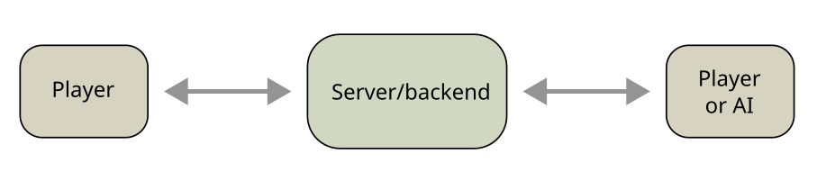
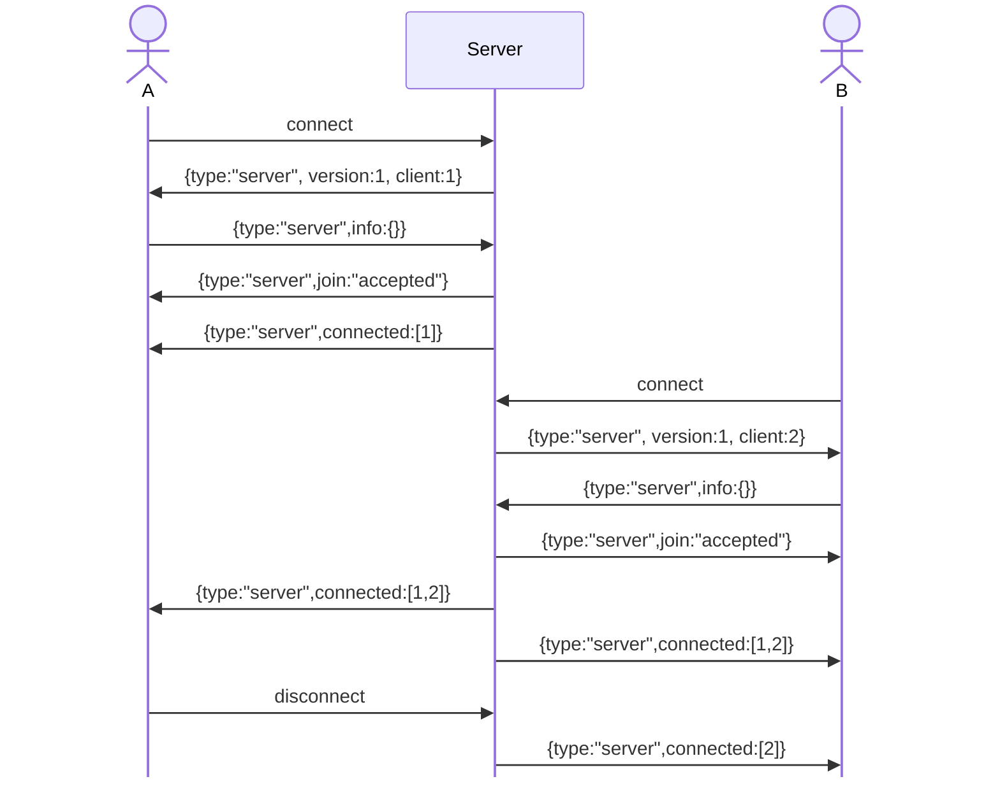
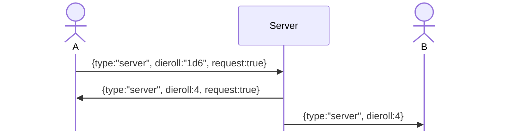
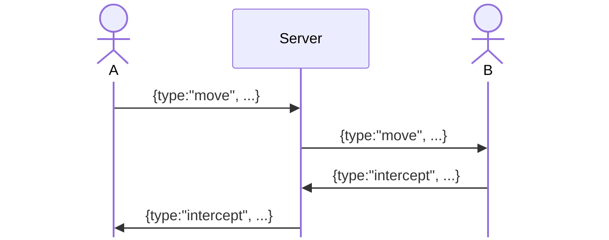
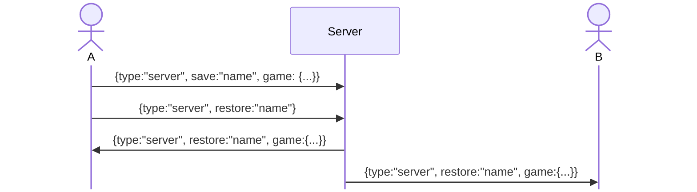

# Game server



Multi-player gaming requires a server. Games are interactive, so
[websockets](https://en.wikipedia.org/wiki/WebSocket) are used.
Since browser script can't read files on the client for security
reasons, a server can be used for save/restore.

How game functions can be distributed between the server and clients
is described in a good way in [this post](
https://longwelwind.net/blog/networking-turn-based-game/). The
extremes are something like:

* The server only relays messages between players. It knows nothing
  about the game (and can thus be generic)

* The server controls everything. The clients just send user actions
  to the server, and updates the UI on server commands

In `hex-games` a generic server is provided, which relays messages
between clients. The philosophy is to let the server do as little as
possible, and let clients sort out things between themselves. Clients
are assigned an integer `id` when connected, which is used for
addressing. The server can handle multiple clients, but the normal
case is two clients.  The server have support for:

* Join server (all accepted)
* Joined client notifications
* Relay messages between clients
* Save/restore games (NYI)
* Dieroll
* *Nothing else!*

Possible future extensions

* Authentication
* Some "group" concept


## Client library

A client is identified with a "client object". This object is defined
and owned by the caller. In callback functions the client object can
be accessed as `this`.

```js
const client = {
	url:"ws://localhost:8081/ws", // Optional
	cbClose: function(){},		  // Close callback (mandatory)
	cbMessage: function(){},	  // Message callback (mandatory)
	ws: WbSocket(),				  // Set by the lib
	id:0,						  // Set by the lib. 0 until succesful connect
}
export async function join(client, info) {}
export function close(client) {}
export function send(client, msg) {}
export async function call(client, msg) {}
export async function dieroll(client, die) {}
```


## Messages

Messages are in [json](https://en.wikipedia.org/wiki/JSON), and have
format:

```js
let message = {
	type: "someType",
	// type specific entries...
}
```

Only messages with type "server" are recognized by the server
itself. All other messages are just passed along to the other clients.

### Server messages

Server messages have type:"server", and are used for communication
with the server itself. They are for instance used on connection setup:



The "version" is the protocol version. Clients must check that they
can handle this version, or disconnect.

The `info` object is not used yet, but may contain things like player
name, authentication token, game name, etc.

Whenever the number of client changes, due to a new "info" message or
a disconnect, a "connected" message is sent to all clients.

### Messages with reply

A client may want to `await` a reply, e.g. for a dieroll, called
`requests` from now on. Then the reply message must be distinguishable
from other messages that may arrive at any time. So the client adds a
`request` item, which must be included in the reply. Since a client is
limited to one outstanding message with reply, the `request` item is a
boolean (a change of this will require a protocol version increment).



The client initiated the dieroll will get a "reply" message, but
dierolls are sent to *all* clients. Any "extra" items in the dieroll
request is also sent to all clients, so to add items in a dieroll
request is *not* a protocol change.


### Peer messages

Peer messages are all messages that have **not** type:"server".
The server relays messages to all connected clients, except the
sending one.



Peer messages *may* be request/reply, but the server is not involved.


### Save/Restore messages

Since browser script can't read files on the client for security
reasons, games can be saved and restored by the server. The games are
saved in files on the server, and may be any json object (the server
doesn't care).



A restore is initiated by one client, but is sent to *all* clients.
