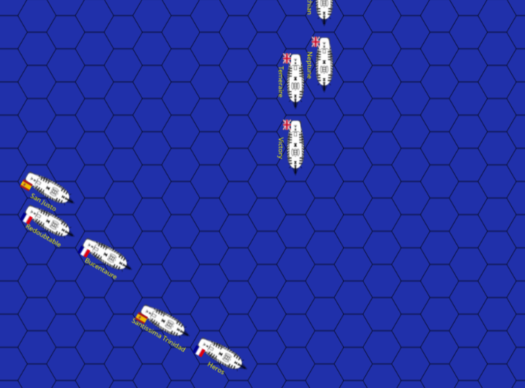
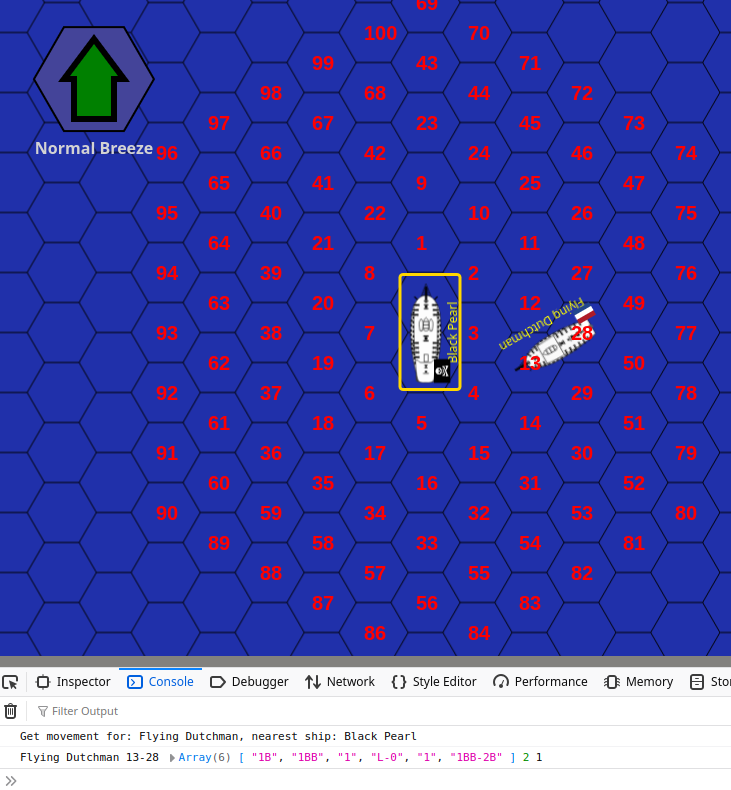
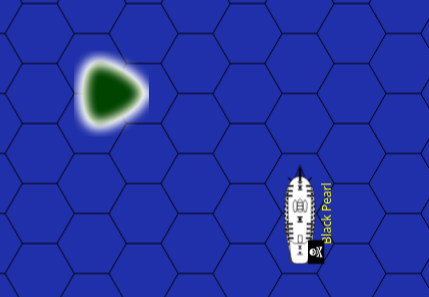

# Wooden Ships & Iron Men

A browser version of the [Wooden Ships & Iron Men board game](
https://boardgamegeek.com/boardgame/237/wooden-ships-and-iron-men) (WS&IM).

**This is a Work in Progress (WIP)**



And yes, you can play against AI, but not large battles. I Recommend
the "nordic encounter" or "Mars v.s. Hercule" scenarios.

Implemented:

* Map with hex'id toggle
* SOL/F counters
* Movement (with nice animations)
* Collisions (stops movement, but never fouled)
* Combat (only 'R' ammo)
* AI for small scenarios
* Sound effects for collisions and gunfire
* User defined scenarios
* Land (causes collision, and block FoF)
* Undiscovered bugs :-)

Not Yet Implemented (NYI):

* Fouling/grappling
* Boarding/Melee/Marines
* Drifting
* Advanced Rules (except full/backing sails)
* Optional Rules
* Anchor
* Skew ships to avoid end-of-map problems
* Gun hits in rule 11.4.3. Use carronades first (as in original rules)
* Ships arriving at later turns
* Reload/ammos. Both sides are always loaded with 'R'
* Smaller vessels. Only SOL and F implemented
* Surrender/cpture ship. Ships strikes when run out of H,G,R,C, and freeze
* Player-vs-Player (PvP) mode (requires a server)
* Large battle AI
* Victory conditions/end-of-game (continues until you close/reload)
* Wind change/wind velocity
* more...?

Please send bugs reports and feature requests as [github issues](
https://github.com/uablrek/hex-games/issues).


### Try it

To define your own scenario, you must run locally:

* Download the [ws-im.zip](
  https://github.com/uablrek/hex-games/releases/latest/download/ws-im.zip)
  asset from the latest [release](https://github.com/uablrek/hex-games/releases)
* Unpack `ws-im.zip` (you **must** unpack/extract, even on Windows)
* Open `index.html` in your browser

**NOTE: You can't save!** If you close your browser/page all progress
  is lost. If you reload the page, you go back to the start. So, if
  you want to zoom in/out in your browser do that *before* starting
  the game, and reload the page (F5)

**NOTE2:** On Ubuntu Linux, Firefox may run in a "snap sandbox", so
  you can't browse local files (file:// URLs). If so, I suggest to
  switch to Chrome, or install Firefox without snap (which I do)

The game is played in sequences of "phases", same as the board game.
An "InfoBox" is displayed to the right and will show relevant info for
the phase, e.g. keys, ship data and a brief help. The wind indicator
is in the upper left corner.

Keys that works in any phase:

* **i** - Toggle hex id's
* **p** - Save the map locally as png. The entire map that is, not only what you see in your browser ([example](https://boardgamegeek.com/image/9598691/uablrek))

You may open "Developer Tools" in your browser to see program
printouts (log). Ctrl-Shift-I on Firefox and Chrome.

## Rules

You **must** read the rules! The game only give help with the
mechanics, and ensures that the rules are followed.

A scan of the original rules (1981, with page 7 missing) is [here](
https://www.hasbro.com/common/instruct/7090001.PDF). For this game I
use mostly the [Tournament Rules](
https://boardgamegeek.com/filepage/224145/wsim-tournament-rules-30-june-2019-complete), but some parts from the original rules.

I implement the `Beginners' Rules` first. The "Advanced Rules" are
intended for experienced players, and are of course much harder to
implement in a program. Since I want to use the scenarios from the
original rules, the ship stats and hit tables are taken from the
original (basic) rules rather than the Tournament Rules.


Additional Rules:

* Backing Sails
* Full Sails (doubles rigging damage as in the original rules)
* To move ships out of the map will cause a collision

## URL and server

The game runs in your browser only, so no server is needed. This will
change for Player-vs-Player (PvP) mode. To run locally use a `file://`
URL in the form:

```
file:///path/to/ws-im.html?sc=nordic&ai=solo&player=se
```

You can make this game available on your own web page/server, if
scripts are allowed (which they aren't on github). Just make a
reference to the original work to fulfil the conditions of the
[CC-BY-4.0 license](https://creativecommons.org/licenses/by/4.0/deed.en).

## AI

The only available AI for now is called "solo". It is an
implementation of the "Solitarie System for WS&IM" by Mark Hunter. A
scan of the article can be downloaded [here](
https://boardgamegeek.com/filepage/2333/solozip). If you read the
article you must admire the skill and effort put into this system!  It
is however intended for fairly small battles, with like 2-6 SOL2
ships. Big, complex scenarios, like Trafalgar, can't be played against
this AI.

**A BIG thanks to Mark Hunter for giving us this system!**

The **big** Enemy Ship Movement Table (ESMT) is derived from
`woodsolo.txt` found [here](
https://boardgamegeek.com/filepage/277738/woodenship-solo-program).
Thanks to [clonea](https://boardgamegeek.com/profile/clonea) for this
work.

The original "Enemy Ship Movement Table" (ESMT) is optimized for SOL2
ships. There seem to be an interest (well, it [was](
https://boardgamegeek.com/thread/3310722/mark-hunters-solo-rules)) to
extend this for other classes. This can be done without altering the
program, in a similar way as for user-defined scenarios. Write an own
version of [solo-tables.js](./solo-tables.js) and copy it to the ws-im
directory (where index.html is) before start.

### AI v.s. AI

This can be useful to check if a scenario is balanced, and it's
fun :-) When playing against the AI, you can press `l` (lazy) to let the
AI play for you.


## User defined scenario

To define a scenario replace the the `sc-user.js` file in the WS&IM
directory (where `index.html` is), and then select "User Defined",
or use a direct URL. Example:
```
// (assuming WS&IM directory /tmp/ws-im)
cp sc-my-scenario.js /tmp/ws-im/sc-user.js
// Open file:///tmp/ws-im/ws-im.html?sc=user&ai=solo&player=br
```

Please note that [sc-user.js](./scenarios/sc-user.js) is a javascript
file, *not* JSON! The only difference though, is that the json data is
enclosed in a javascript string. I recommend to edit the json data to
get aid from your editor, and add the javascript string when done.

The "id" in the user defined scenario file can be anything, it is
always loaded as "sc=user". Define wind.d=0 to get a random wind
direction. TIP: reload the page (F5) to re-roll the wind direction.

Please contribute your scenarios if you like, preferably in a github
pull-request (PR).

### The test scenario, and test mode

If the User defined scenario has `id="test"`, then you will enter
"test mode". In Planning phase you can toggle the hex-values for the
"Enemy Ship Movement Table" (ESMT), and change the wind
direction. This should make it easier to customize the ESMT (but it's
still a lot of work). The ESMT is also extended with another "layer",
which I think is useful for F3/F4 ships.  If the "Flying Dutchman" is
present, it has movement 7 in all directions. Damage from combat is
displayed, but not applied.



Above is a screenshot from the default test scenario. The "Web
Developer Tools" are activated (Ctrl-Shift-I), so you can see the
console printouts. The lookup in the ESMT looks like:

```
Flying Dutchman 13-28 Array(6) [ "1B", "1BB", "1", "L-0", "1", "1BB-2B" ] 2 1
```

The bow-stern values are "13-28", the wind aspect is 2 (Port C), and
the suggested move is "1".


## Development

For general development process and dependencies, please see [hex-games](
https://github.com/uablrek/hex-games/blob/main/HEXGAMES.md).

Ship graphics are my own, created with [Inkscape](
https://inkscape.org/), and not very pretty (I am no artist). But the
small size of the ship counters make them OK (IMHO). Flags are taken
from https://flagicons.lipis.dev/, except the [us flag](
https://sv.wikipedia.org/wiki/Fil:Flag_of_the_United_States_(1795%E2%80%931818).svg),
and [Jolly Roger](https://commons.wikimedia.org/wiki/File:Jolly-Roger.svg).
Sound effects (collision, gun-fire) are taken from [pixabay](
https://pixabay.com/sound-effects/).

### Scenarios

Scenarios are defined in separate [json](
https://en.wikipedia.org/wiki/JSON) files. Scenarios are included in
`bundle.js` (except the user defined scenario), so a rebuild is
required when adding or modifying scenarios. To define a scenario is
tedious and error prone, so contributions (issues or PRs) are
appreciated.

To understand how to define a scenario, please look at
[sc-trafalgar.json](./scenarios/sc-trafalgar.json). The `id` must be
unique, and is used to identify the scenario when loading, example:

```
file:///path/to/ws-im/ws-im.html?sc=trafalgar
```
The ship classes are defined in [tables.js](./tables.js). The Spanish
`SOL2-64` has no pre-defined class, and must be fully defined.

Special rules, special ship entries, and special victory conditions,
can't be defined in the json file alone, but requires additional
programming.

The map can be extended to 99x99 (the original is 51x35), so all
ships can be placed from start. Please see
[sc-trafalgar2.json](./scenarios/sc-trafalgar2.json) for an example.
Hex id's outside the original map are in the form "XXYY", e.g. "0312".

### Land

Land is defined in the "map" section of a scenario:

```json
    "map": {
        "focus": "AA20",
        "mapProperties": [
           {"hex":{"x":16,"y":18},"prop":"1"},
           {"hex":{"x":17,"y":18},"prop":"1"},
           {"hex":{"x":16,"y":19},"prop":"1"}
        ]
    }
```

Only coastal-line hexes are defined. You can define land areas
0-9. The example above generates a minimum island (3 corners). The
land area, defined by the coastal-line, forms a polygon implemented
with a closed [Konva.Line](https://konvajs.org/api/Konva.Line.html).
The "smoothing" is implemented using the "tension" property.



Land areas off-map (not islands) are not closed. They must have 2
not-adjacent edge-hexes defined. Land areas in corners are not yet
implemented.

As in the other "hex-games" projects, there is a `map-maker` program
that allows land to be defined by clicking on the map.

### The ship object

A full Ship definition may look like:
```js
const ship = {
    name: "Victory",
    nat: "br",
    class: "SOL1",
    nguns: 100,
    ii: "sol",           // image identifier
    img: {},             // generated
    i: 0,                // index in the ship array
    hull: 18,
    depth: 23,
    cq: "El",
    crew: "5-5-5",
    rigging: "8-8-8",
    guns: 11,
    car: 1,
    pv: 33,                  // point value
    ih: {hex:"HH19",d:4,t:0},// initial hex, 'd' is 1-6, enter turn 't'
    // (hex,d makes the ship a "hd-item")
    hex: {x:34, y:12},       // current position
    d: 3,                    // current direction (internal rep 0-5 NOT 1-6!)
    mov: {
         turn: 1,
         battle: {
            A: 3,
            B: 2,
            C: 1,
            D: 0,
         },
         full: {
            A: 5,
            B: 4,
            C: 2,
            D: 0,
         },
    },
    // Stats. Format for programming, and will be altered
    // (different for advanced rules)
    s: {
        hull: 18,
        crew: [5,5,5],
        rigg: [8,8,8],
        guns: {l:11, r:11},
        car: {l:1, r:1},
    },
    fullSails: false,
    setSails: "Full",        // set during planning, effective after combat
	dismasted: false,        // may only drift and turn (rule 8.2.5)
	surrendered: false,
    ammo: {l:'R', r:'R'},    // set to '' when fired
    turnsUnmoved: 0,         // for drifting
    hasFired: false,         // for initial broadside
    m: "L11",                // movement notation
    // During Combat phase
    fof: {l:Map(), r:Map()}, // Field-of-Fire
    targets: {l:[], r:[]},   // Targets. Arrays of ships
    targetIndex: 0,
	target: {s:s, b:'l'},    // current target on side 'b'
	dmg: [{s:s,dmg:"2H-C"}], // damage taken from ship 's'
}
```
